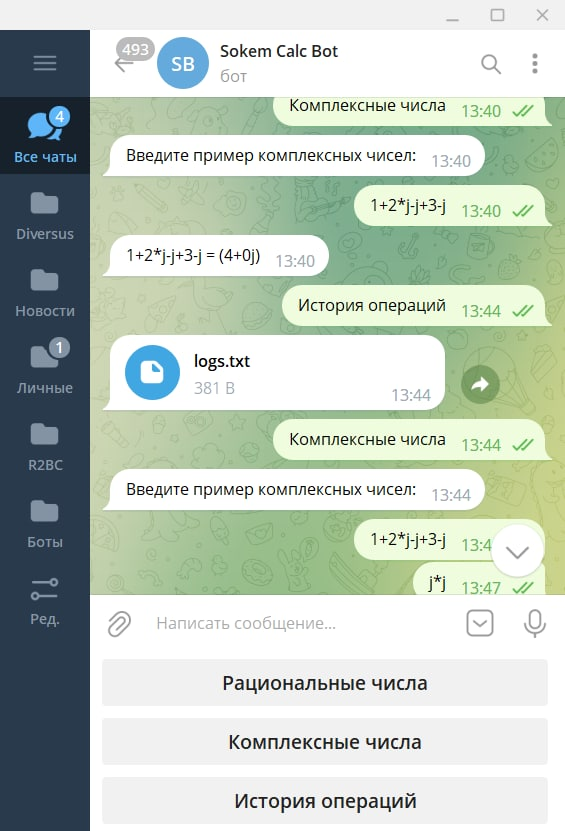
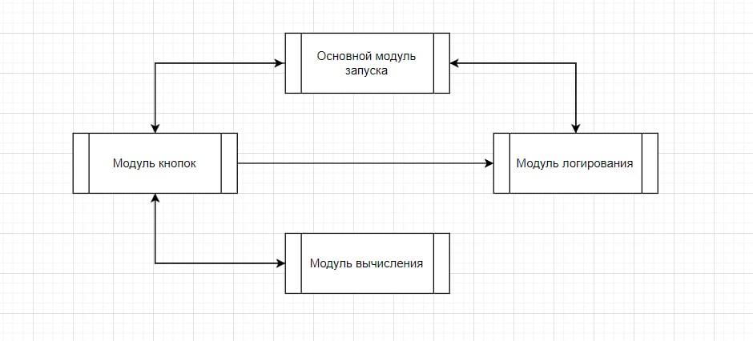
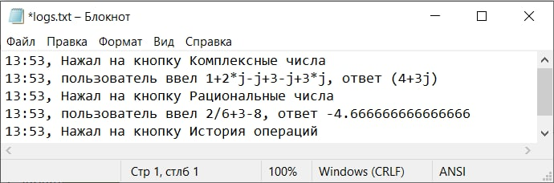

 
Выполнил работу: Кремешный Роман (sokems@mail.ru)

## Условие задачи: 
Создать калькулятор для работы с рациональными и комплексными числами, организовать меню, добавив в неё систему логирования. Желательно соблюсти разбиение на модули.

## Комментарий разработчика: 
Реализовал вычисление комплексных чисел через функцию eval. Преподаватель дал добро.

## Ссылка на бот в телеграме:
http://t.me/sokem_calc_bot

## Возможные операции: 
+ Сложение рациональных и комплексных чисел
+ Вычитание рациональных и комплексных чисел
+ Умножение рациональных и комплексных чисел
+ Деление рациональных и комплексных чисел

## Описание архитектуры:
- README.md - информация о программе 

- diag.drawio - сжатая блоксхема архитектуры 

- logs.txt - логи программы 
- модули.py - модули программы

### Модули:
1. calc - модуль вычисления. Выполняет арифметические операции с сохранением приоритета.
2. log - модуль логирования. Записывает в файл logs.txt историю действий пользователя.
3. buttons - модуль кнопок. Вызывает отклик бота на нажатие на кнопки.
4. main - основной модуль запуска бота. Запуск бота происходит с данного модуля.

