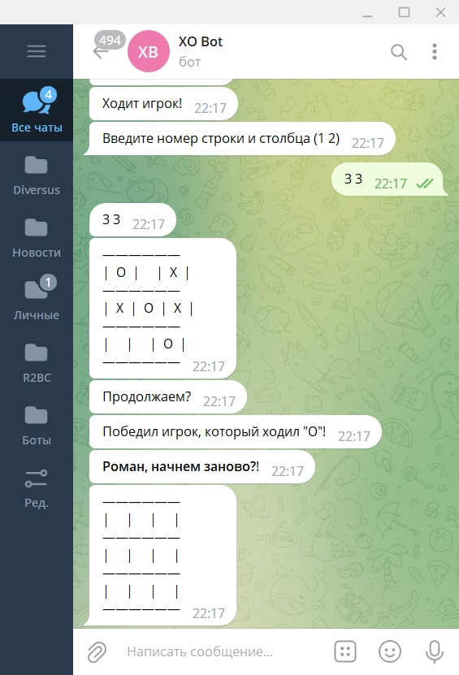
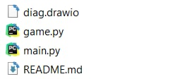
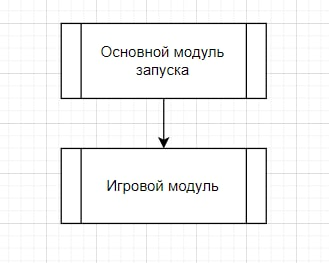

 
Выполнил работу: Кремешный Роман (sokems@mail.ru)

## Условие задачи: 
Игра в крестики-нолики.

## Ссылка на бот в телеграме:
http://t.me/sokem_xo_bot

## Описание архитектуры:
- README.md - информация о программе 
- diag.drawio - сжатая блоксхема архитектуры 

- модули.py - модули программы

### Модули:
1. game - игровой модуль. В нем расписаные такие функции, как "создание поля для игры", "показ поля на экран", "логика игры бота" и "проверка на победу"
2. main - основной модуль запуска бота. Запуск бота происходит с данного модуля.

